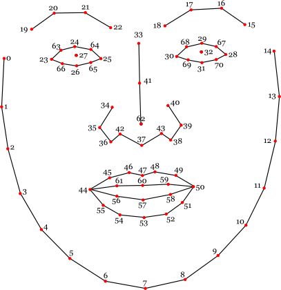

# Face Tracking to Websockets

I made this as a way to get face tracking to happen easily in TouchDesigner since it didn't seem like there was a simple
way to make it happen. This method uses the [clmtrackr](https://github.com/auduno/clmtrackr) JavaScript library to do
the face tracking in your web browser, using your webcam. It then sends that data as JSON via a WebSocket to a waiting
server in TouchDesigner. 

## The Gist

### In TouchDesigner

1. Create a network with a **Web Server DAT**
2. Set that operator's "Port" parameter to a port number (like `12000`) and turn the "Active" parameter on
3. Edit the `onWebSocketReceiveText` function in the attached callbacks window to contain the line `op('text').text = data`
4. Create a **Text DAT** (named `text1`) and change its "Content Language" parameter to `JSON`
5. Connect the output of the Text DAT to a **JSON DAT** and change its "Output Format" parameter to `Table`
6. Connect the output of the JSON DAT to a **DAT to CHOP**

### In a Browser

1. Download the `index.html` file and put it in a folder on your computer
2. Open the file in your browser (probably using Ctrl+O)
3. Enter the facial features (aka landmarks) that you're interested in. See the diagram below
3. Type the address and port of the server (e.g. `localhost:12000`) in text field and click Connect

You should already be seeing channels of data about facial features appearing in TouchDesigner. While the width and height 
of the video are set to 400x300 (you can change this in `index.html` if you want to), the values sent to TouchDesigner are always in the range -.5 to .5

## Landmarks

This diagram (originally from the [clmtrackr](https://github.com/auduno/clmtrackr) repo) shows the numbered coordinates for each of the landmarks.
The channel names in TouchDesigner will be "32_x" and 32_y" for landmark #32's x and y coordinates, for example.

## Troubleshooting

If something isn't working, try a different browser. You can also check your browser's console window (F12 on most browsers) to see if there are errors.

If you're seeing data appear in TouchDesigner, but only sometimes, it's important to realize that web browsers normally won't continue
sending data if you switch to a different tab in the browser. You can switch away from the browser to TouchDesigner, but you can't switch to a different browser
tab. 

If the incoming data is slowing down or data appears intermittently, it's possible that your computer isn't up to the task of doing all of this work at once. Or maybe too much data is being sent/received, in which case you should limit the landmarks to only the ones you care about.

If your camera isn't working, make sure that you aren't trying to use it in two places at once. *TouchDesigner can't use the camera
at the same time as the browser*. Also, make sure you don't have the `index.html` file open in more than one browser window since they 
could both be trying to access the camera at once.

If the browser isn't able to connect to TouchDesigner via WebSockets:
1. Use `localhost` or `127.0.0.1` as the IP address
2. Make sure that the port number is the same in the browser as it is in the **Web Server DAT** "Port" parameter
3. Verify that "Active" parameter is turned ON in the **Web Server DAT**

## License

This repo is distributed under the [MIT License](http://www.opensource.org/licenses/MIT). So is [clmtrackr](https://github.com/auduno/clmtrackr).
